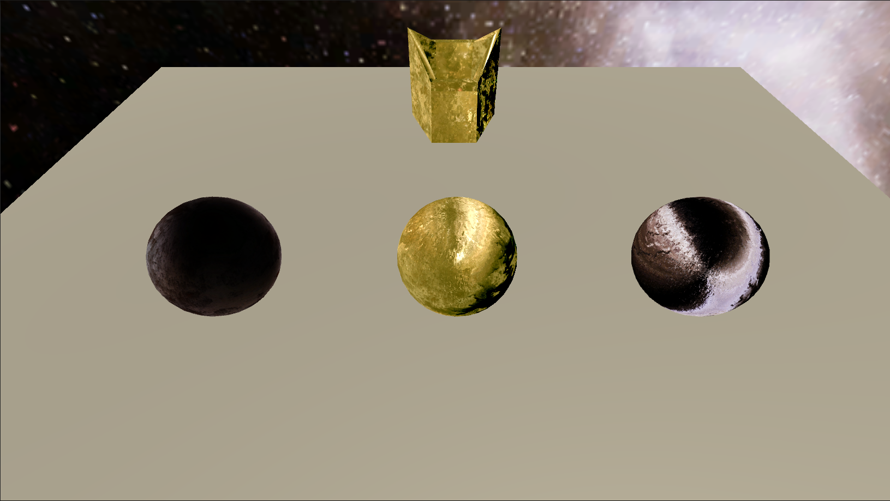

# キューブマッピング

* 空にキューブマップを張ろう
* ノーマルマッピングしてみよう
* 拡散キューブマップをしてみよう
* 環境マッピングをしてみよう
* ノーマルマッピングをしてみよう
* 今までの反射を合成してみよう

# 自分なりに変更した点

-
-
-
-

# 進め方

- 本リポジトリをフォークしてください
- フォークしたリポジトリをcloneします
- Unityのプロジェクトを更新して実装してください。
- このテキストファイルに変更点を記載してください
- result.pngを自分の結果を保存して差し替えてください
- プルリクエストを出して提出してください
